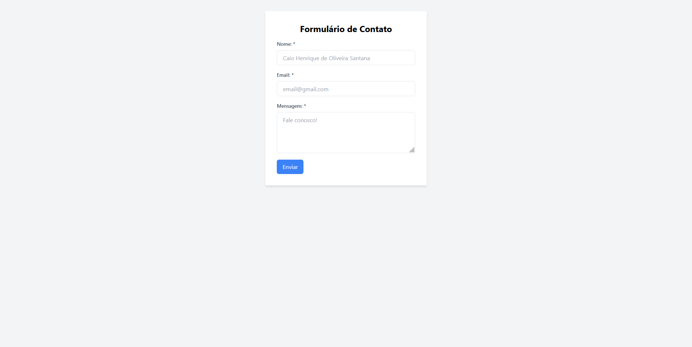

## **Formulário de Contato**

**Um simples formulário de contato desenvolvido em HTML, Tailwind CSS e JavaScript.**

### Funcionalidades

- **Nome:** Campo obrigatório para inserção do nome do remetente.
- **Email:** Campo obrigatório para inserção do endereço de email do remetente.
- **Mensagem:** Campo obrigatório para inserção da mensagem que o remetente deseja enviar.

Ao clicar em "Enviar", os dados são validados e uma mensagem é gerada para ser enviada para um número de WhatsApp.

### Estrutura do Projeto

- **HTML:** `index.html`
- **CSS:** Tailwind CSS integrado diretamente
- **JavaScript:** `script.js`

### JavaScript: Como Funciona

O arquivo `script.js` contém a lógica em JavaScript para validar os campos do formulário e gerar uma mensagem formatada para o WhatsApp.

- **`enviarDados()`:** Função principal chamada ao clicar no botão "Enviar". Ela coleta os dados do formulário e chama a função `verificaCampos()`.

- **`verificaCampos()`:** Realiza a validação dos campos, destacando visualmente quais campos não foram preenchidos corretamente. Se todos os campos estiverem corretos, chama a função `enviarWhatsapp()`.

- **`enviarWhatsapp()`:** Gera uma URL com os dados formatados e abre uma nova janela para enviar a mensagem para um número de WhatsApp pré-determinado.

### Como Contribuir

Sinta-se à vontade para forkar o repositório, implementar melhorias e enviar um pull request.

### Autor

Desenvolvido por **[Caio Henrique de Oliveira Santana]**. Contato: **[caiohenrqq@gmail.com]**.

